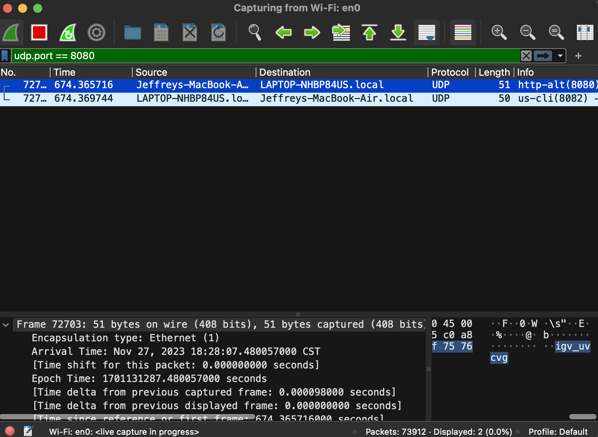

# Security Final Project Group 15

## Participants

- **Brent Hoover**
- **Jeffrey Hsu**
- **Mandil Pradhan**
- **April Valdez**
- **Viet Vu**

# Description

### Demonstrate security and vulnerabilities

Our system simulates a network that facilitates communication between a central hub and peripheral IoT devices.

Our demostration will..

- expose the vulnerabilities that are typical of these systems.
- show how we secure certain vulnerabilities by encrypting commands.
- discuss other potential vulnerabilities like authentication.

# Assumptions

- Shared secret keys were shared between the hub and IoT devices beforehand.
- Any user with access to the Hub is an authenticated user.
  (Our project only addresses inter-network security vulnerabilities.)
- Network is open or compromised for malicious parties to connect to.

# How to Run

> dependency: python3

### A. Single-Device Method

#### 1. Navigate to main project directory

#### 2. Setup the config file

- Open up `./data/config.py`
- Change all 4 IPs to your IP address.
- ex:
  ```python
  HUB_IP = "192.168.2.5"
  CAMERA_IP = "192.168.2.5"
  DOORLOCK_IP = "192.168.2.5"
  THERMOSTAT_IP = "192.168.2.5"
  ```

#### 2. Execute Hub: `python hubUI.py`

- A GUI will pop up in another window.

#### 3. Execute DoorLock

- Open up a new terminal and execute `python doorlockIOT.py`

- The program will run in the same terminal.

#### 4. Execute Thermostat

- Open up a new terminal and execute `python thermostatIOT.py`

#### 5. Execute Camera

- Open up a new terminal and execute `python cameraIOT.py`

#### 6. Register Devices in Hub

- Go back to Hub.
- Enter the ID (arbitrary), IP, and port for all 3 IoT devices.
- ex:

```md
Device ID: my_door_lock
Device IP: 192.168.2.5
Device Port: 8082
```

- Note that the IP and Port needs to match the values in `config.py`.
- Click on [Add Device]. The new device will show up on the bottom of the Hub GUI.

#### 7. Send a Command

- Click on [Send Message]. A new window will pop up.
- Enter the ID and Message.
- ex:

```md
Device ID: my_door_lock
Message: get_status
```

- Click on [Send] and observe the returned response in the Hub GUI.

> Note: avaliable commands are listed below for each device

---

### Multi-Device Method

Follow the same steps as the Single-Device method. Use a new computer instead of a new terminal window for each IoT Device.

> Remember to set the correct IP addresses for the Hub and each IoT device in `config.py`. The ports can be changed as well but it has to match each other.

---

### Attack

When sending messages between Hub and IoT devices, open up **WireShark** and set the filter to `udp.port == 8080`, where `8080` is the Hub's port number set in `config.py`.



- Note the `igv_uvcvg` on the bottom right — that is the encrypted message.

> Do not be on Bobcat Network.

# Functionalities

### Hub - IoT Communication

The Hub and IoT devices can communicate bi-directionally over a local network using UDP/TCP. Communication consists of commands and relevant parameters.

### IoT

These IoT devices are modeled after real commercialized products with simulated capabilities.

- Send the command in this format:

  - format: `command;parameter`
  - ex: `set_state;on`

- smart door lock
  - `set_state`: on, off
  - `set_status`: lock, unlock
  - `set_keyless_entry`: code (where code is a 4 digit integer)
  - `set_lock_time`: time (where time is in format hh:mm)
  - `get_state`
  - `get_status`
  - `get_keyless_entry`
  - `get_lock_time`
- thermostat
  - `get_status`
  - `get_state`
  - `get_temperature`
  - `set_temperature`: temp,fan_speed
    - (where temp is a float, fan_speed is high, med, low)
  - `turn_on_heater`
  - `turn_on_ac`
  - `turn_off`
- security camera
  - `get_status`
  - `set_status`: live, off
- real IoT camera
  - `get_status`
  - `camera_on`
  - `camera_off`
  - `take_photo`
  - `set_frame_option`: Provides option for image setting
  - `get_frame_option`: Option provided using (set_frame_option)

### User

The user is able to interface and direct the Hub through a GUI. The Hub is multi-threaded to handle sending and receiving simutaneously.

### Attacker

The attacker is able to use WireShark sniff and inspect the packets being sent.

### Encryption / Decryption

All inter-network communication are encrypted and decrypted upon sending and receiving respectively.
Both Vignere Cipher and Caesar Cipher are implemented.

[todo] picture of encrypted packet on Wireshark vs un-encrypted packet

### Integration with real IoT

ESP32 Camera on Micropython. Takes photos at different qualities and transfers them over to the Hub. Establishes connection with UDP and sends the actual photo with TCP.

Commands to the camera is encrypted but the photos are currently un-encrypted.

### Authentication

Devices have to be registered by the user on the Hub (through the GUI).

# Files

### Executables

- **cameraIOT**.py:
  - simulates a security camera IoT device
- **doorlockIOT**.py:
  - simulates a smart door lock
- **hub**.py:
  - the main hub that commands all connected IoT devices
- **hubUI**.py:
  - GUI for hub.py
- **realCameraIOT**.py:
  - executable that runs an actual security camera IoT
  - (note: only runs on Micropython)
- **thermostatIOT**.py:
  - simulates a thermostat

### Utility

- **Caesar**.py:
  - provides Caesar Cipher for devices
- **communicator**.py:
  - class inherited by all executable devices
- **Encryption**.py:
  - wrapper class for ciper implementations
- **IOTdevice**.py:
  - abstract class, implemented by actual IoT devices
- **README**.md:
  - me
- **Vigenere**.py:
  - provides Vigenere Cipher for devices

# Troubleshooting

### I am getting a UDP error!

```
UDP_socket.bind((self.ip, self.port))
OSError: [WinError 10049] The requested address is not valid in its context
```

- Solution: Make sure the device's IP address in `config.py` matches the computer's actual address. (Double check your computer's IPv4 address using `ipconfig`)

### My messages are not sending!

- Solution: Make sure the network you are connected to does not block the UDP ports you specified in `config.py`.
